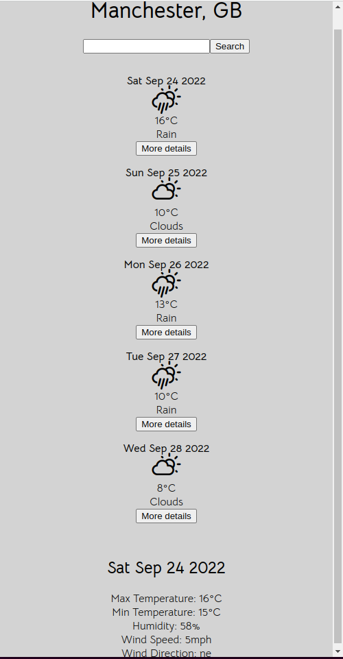

# Weather App

This is my first project as part of the front-end module of the Manchester Codes software development bootcamp.

In this project I have built a Weather App user interface, developing my skills in React along the way.

This app fetches data from the Manchester Codes weather API based on a user search of UK cities.

## Screenshots

### Browser

### Mobile

## Technologies Used

### Language

- Javascript
- React

### Testing

- Jest
- React Testing Library

### Packages

- Axios
- PropTypes
- React Weather Icons

### Styling

- CSS

## Installation

Clone the repo: `git clone https://github.com/tdot124/weather-app`

`cd` into folder and install dependencies using `npm install`

To start weather app use `npm start`

## Using Weather App

The default city is Manchester. You can use the search box to search for a city in the UK you would like the forecast for. If the app cannot find the city you are looking for it will display an error message.

## What I would do with more time

With more time I would like to add an option of selecting a dark or light theme using 'useContext' and add icons for wind direction.

## Created By

Tom Mills
